# SecureRide Shield Project README

## Team

| Number | Name              | User                             | E-mail                              |
| -------|-------------------|----------------------------------| ------------------------------------|
| 112467  | Elie Bruno     | <https://github.com/FlavienVa>   | <elie.bruno@tecnico.ulisboa.pt>   |
| 112848  | Flavien Valea      | <https://github.com/eliemada>     | <flavien.valea@tecnico.ulisboa.pt>     |
| 112763 | Tanguy Vésy  | <https://github.com/TonyVesy> | <tanguy.vesy@tecnico.ulisboa.pt> |


## Introduction 

SecureRide Shield is the new system available to communicate with your electric car! The system allows users to configure the car remotely, such as close/open the car; configure the AC; check the battery level.

This is done by a user application installer on the users computer. Additionally, and to maintain the car up to date, the car also allows for firmware updates from the manufacturer.

## Contents

This repository contains documentation and source code for the *Network and Computer Security (SIRS)* project.

The [REPORT](REPORT.md) document provides a detailed overview of the key technical decisions and various components of the implemented project.
It offers insights into the rationale behind these choices, the project's architecture, and the impact of these decisions on the overall functionality and performance of the system.

This document presents installation and demonstration instructions.

## Requirements 
* Apache-maven 3.9.5: build automation tool for Java projects
* Java Development Kit 17 (JDK 17)

## Installation

To see the project in action, it is necessary to setup a virtual environment, with 3 networks and 4 machines.  

The following diagram shows the networks and machines:

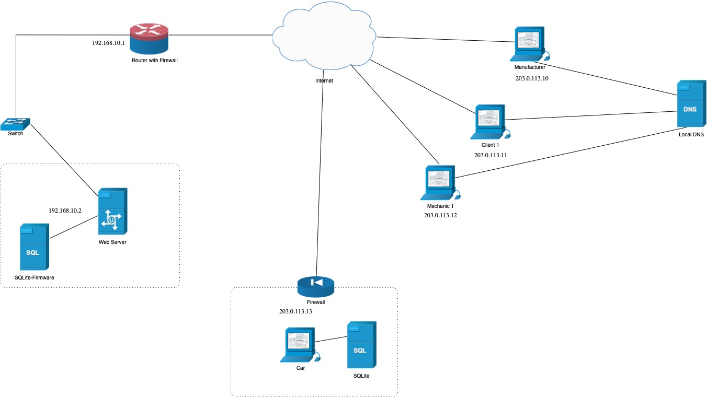


### Prerequisites

To set up virtual machines based on Kali Linux 2023.3, follow these steps:

1. Download the Kali Linux 2023.3 Virtual Machine Image:
        Visit the official Kali Linux [download page](https://www.kali.org/get-kali/#kali-virtual-machines).
        Select the appropriate virtual machine image compatible with your virtualization software (e.g., VMware or VirtualBox). You can also follow the course guidelines [here](https://github.com/tecnico-sec/Setup/) to set up the machine.

2. Install the Virtual Machine:
        For detailed installation instructions, refer to the official Kali Linux [documentation](https://www.kali.org/docs/virtualization/install-virtualbox-guest-vm/).
        This guide provides step-by-step instructions for setting up Kali Linux in VirtualBox.

3. Clone the Base Machine:
        After setting up the base Kali Linux virtual machine, you can clone it to create additional machines as needed.
        Cloning ensures consistency across your virtual environments and saves time on configuration.


### Machine configurations

For VM1 server, the mapping with the network should be: eth0 is connected to sw-1.

For VM2 server, the mapping with the network should be: eth0 is connected to sw-1 and eth1 is connected to sw-2.

For VM3 server, the mapping with the network should be: eth0 is connected to sw-1.

For VM4 server, the mapping with the network should be: eth0 is connected to sw-2.

For VM5 server, the mapping with the network should be: eth0 is connected to sw-1.

For each machine, there is an initialization script with the machine name, with prefix `init-` and suffix `.sh`, that installs all the necessary packages and makes all required configurations in the a clean machine.


Inside each machine, use Git to obtain a copy of all the scripts and code.

```sh
$ git clone https://github.com/tecnico-sec/A38-MotorIST.git
```

Next we have custom instructions for each machine.

#### Machine 1

This machine runs the client 1, the client can send message to the car. You need to call the ``UserCLI.java`` function to start.

To verify, this will give you a list of all available commands:

```sh
$ help
```

To test:

```sh
$ connect vm2 5000 config_owner1.json     - Connect to VM2 server with config file
```
The car is supposed to respond, if the car server is started at port 5000 of course. 

#### Machine 2
This machine runs the manufacturer, the manufacturer can retrieve updates form the webserver and send them to the car.  You need to call the ``ManufacturerCLI.java`` function to start.

To verify, this will give you a list of all available commands:

```sh
$   help
```

To test:

```sh
$ send-firmware 1234 1234XYZ 5001         - Send a firmware update to the car
```

This will retrive the firmware from the webserver and send it to the car. Both server (car and webserver) need to be up and runing. The webserver needs to be started at port 5000. 

#### Machine 3
This machine runs the car, it contains a SQLlite file to store all the data of this same car.  You need to call the ``CarCLI.java`` function to start.

To verify, this will give you a list of all available commands:

```sh
$   help
```

To test:

```sh
$ start-server 5000 - Start the Car server on the specified port
```

The expected results is that a server will be started at port 5000, listening to any connection from User1, User2 or Manufaturer. 


#### Machine 4
This machine runs the webserver, this webserver stores sotfware updates. It can be reached by the manufacturer who can then send this update to a car. It also runs a SQLlite file to store the data.  You need to call the ``WebServerCLI.java`` function to start.


To verify, this will give you a list of all available commands:

```sh
$ help
```

To test:

```sh
$ start-server 5001    - Start the WebServer on the specified port
```

The expected results is that a server will be started at port 5001, listening to any connection from the Manufaturer. 

#### Machine 5
This machine runs the mechanic, this mechanic can access the user configuration if autorized by the user. For that it can launch a secure server on witch the user can send him the path to his key. You need to call the ``MechanicCLI.java`` function to start.


To verify, this will give you a list of all available commands:

```sh
$ help
```

To test:

```sh
$ start-server <port> <host>   - Start the server of the mechanic to get the user key
```

## Demonstration

Now that all the networks and machines are up and running, we can get a list of all available commands on each machine with:  

```sh
$ help 
```

This will give us, for example : 

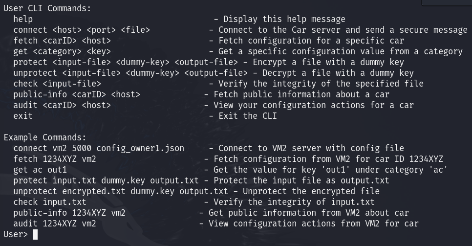

Now that we know all commands for each machine we can start the servers (the car server and the webserver). 

```sh
$ start-server 5000 
```
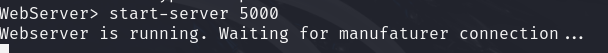
```sh
$ start-server 5001 
```
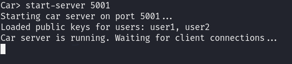

Then we can communicate with the car, let's try to connect to the car from the user1 (here we have previously named the user ``user1`` when asked). Note that the ``localhost`` must be replace by the name of the vm you are talking to. 

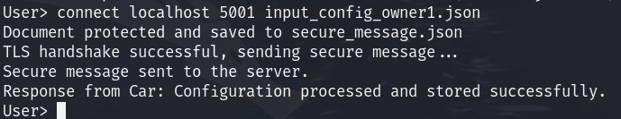
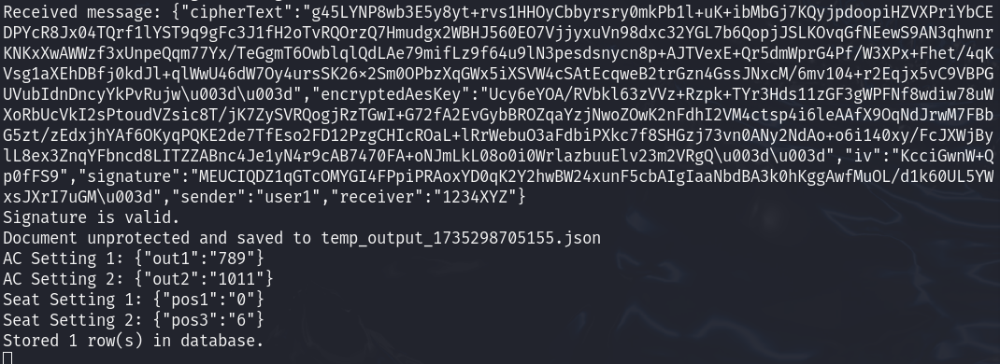

The data has been stored in the car, yeah! Let's try to send an firmware update next. Three machine are involved in this communication, it can be a bit hard to uderstand.

1. The Manufacturer makes the request and send it back to the car.
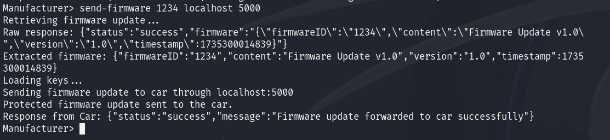
2. The webserver respond and send the firmware.
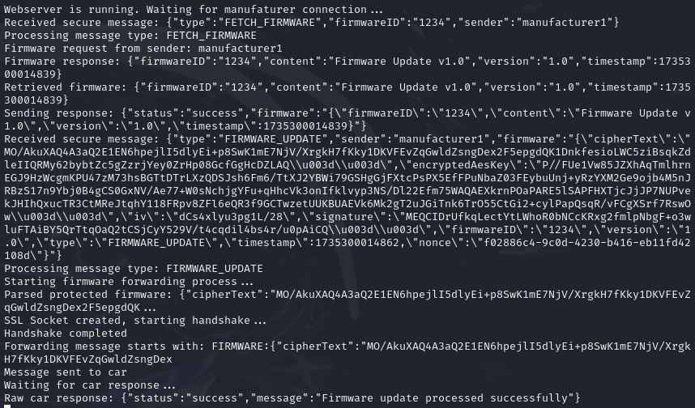
3. The car receive the firmware and send a confirmation.
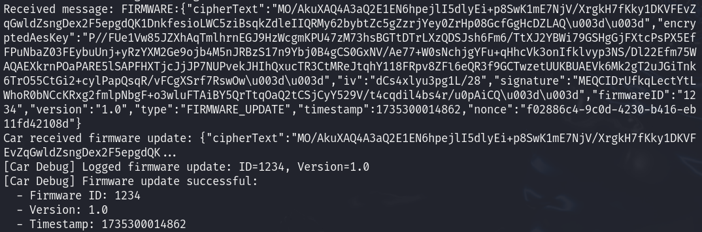

We can also audit a car to see who send what (not in detail but just who and when) to this car.

The user1 asking for an audit (the answer message is longer but doesn't fit in a screenshot).
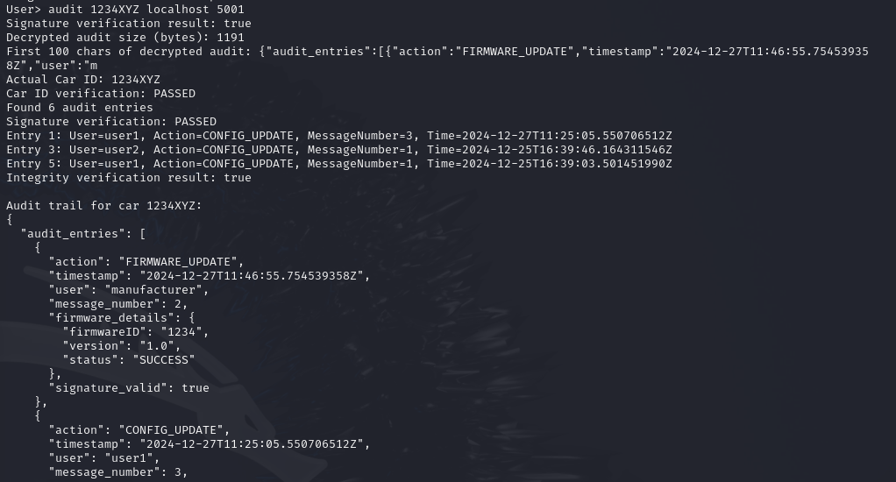
The car verifying that the user1 has the right to do this.
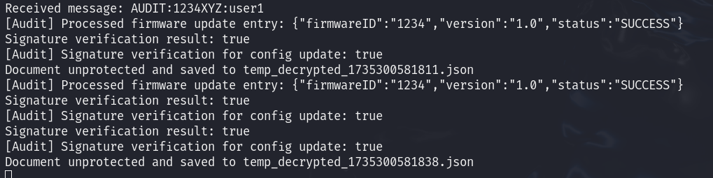


This concludes this simple demonstration, a lot of other commands are available, once again see the ``help`` function for more informations. 

## Additional Information

### Links to Used Tools and Libraries

- [Java 11.0.16.1](https://openjdk.java.net/)
- [Maven 3.9.5](https://maven.apache.org/)

----
END OF README
